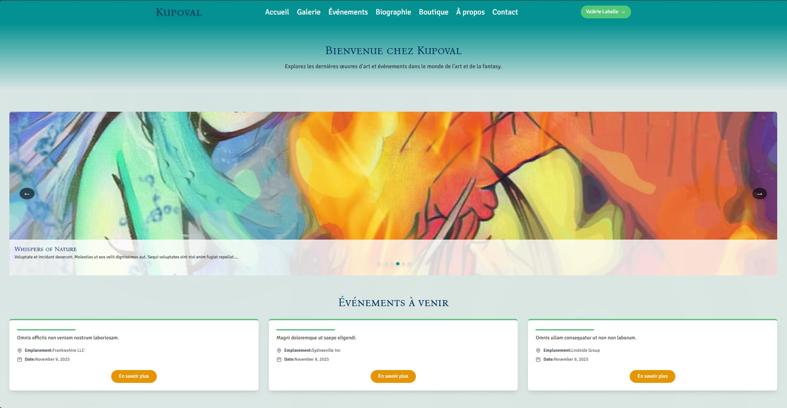
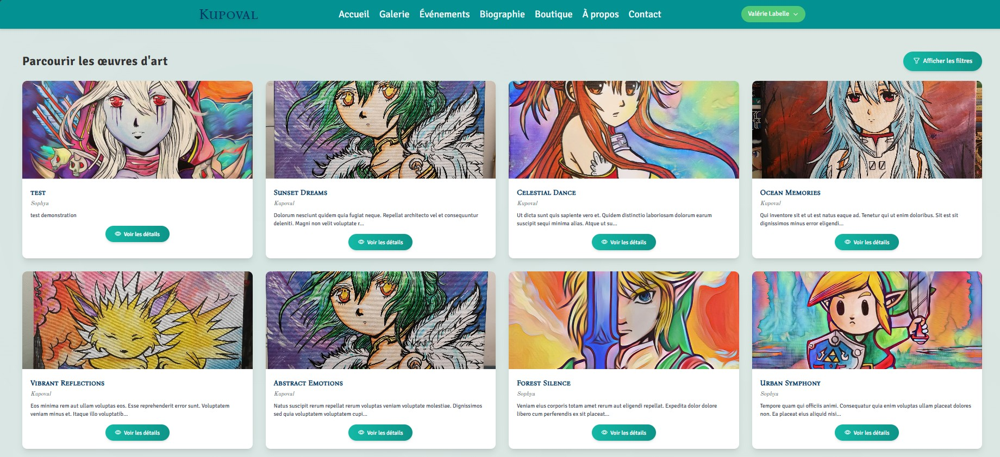
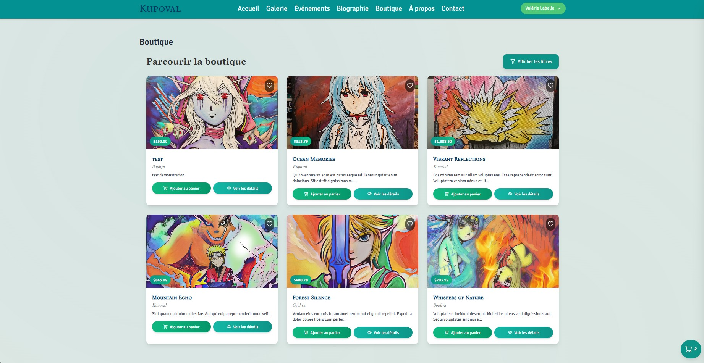
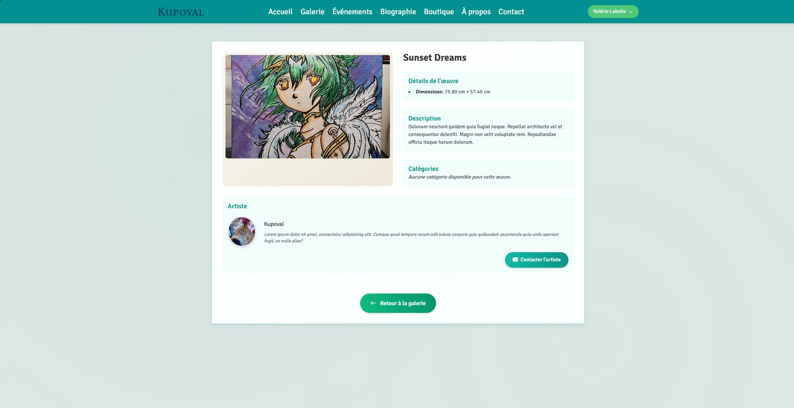
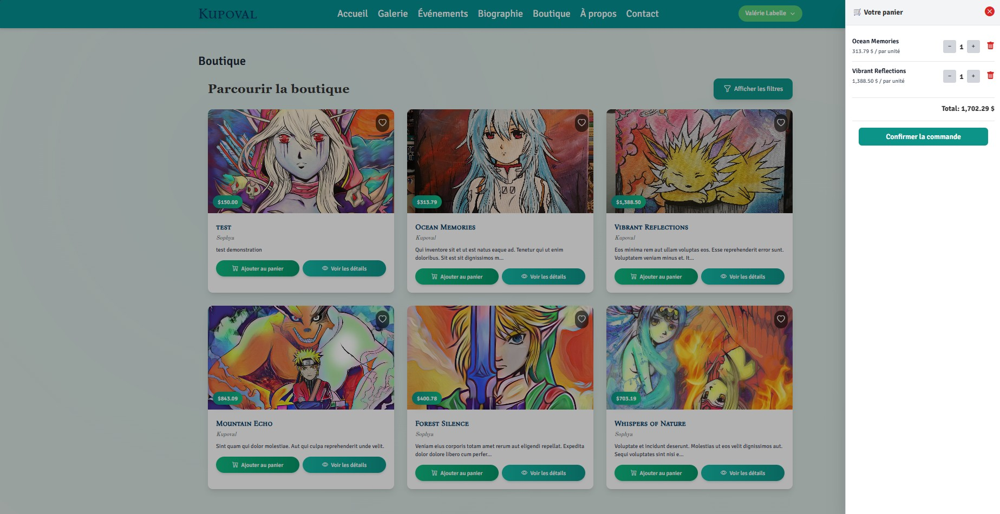
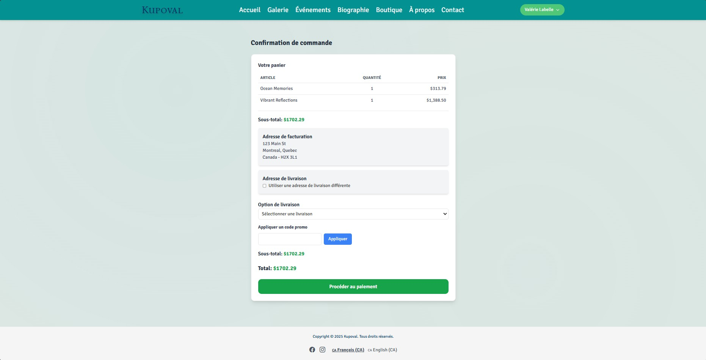
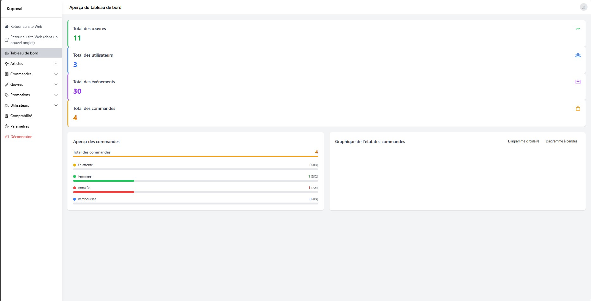
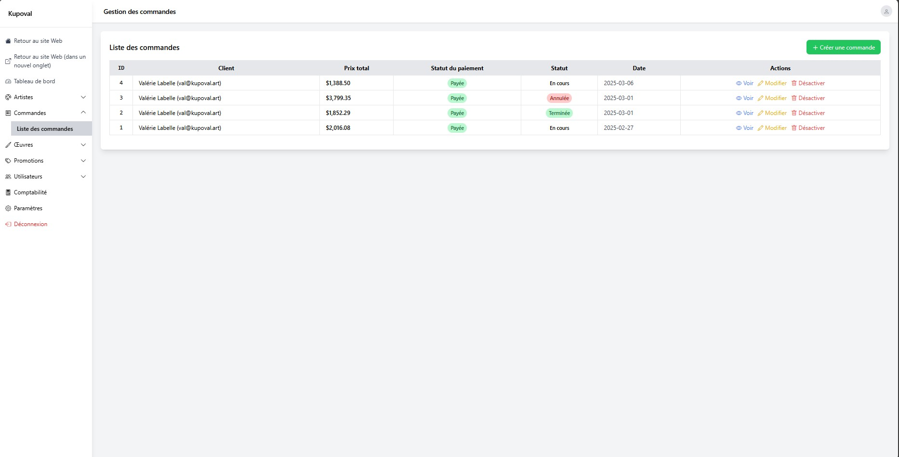
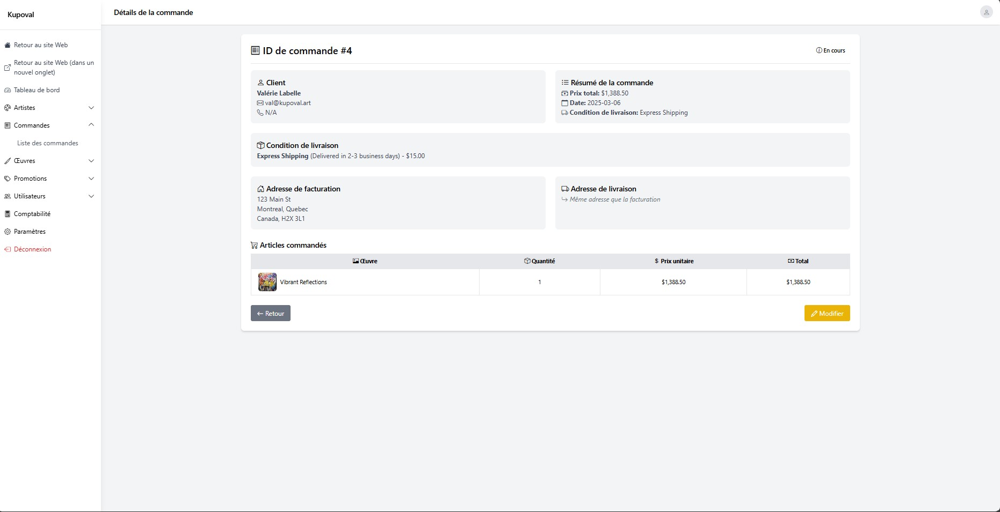

# Kupoval — Laravel / Livewire Artwork Portfolio & Shop
*(English • Français — voir plus bas)*  
*Développé au Québec*

Kupoval is a full-stack web application built with **Laravel**, **Livewire**, **Alpine.js**, **Tailwind CSS**, and **PostgreSQL**.  
It provides a **server-driven UI** for managing and displaying artwork, handling customer orders, and processing payments through **Stripe**.

The application includes both the **public-facing portfolio/shop** and a **secured administration dashboard** for managing artworks, users, orders, and shipping details.

This project was completed over a 12-week delivery cycle, covering requirements analysis, data modeling, UX workflow planning, and full application implementation. The original scope was structured for a small team; here, analysis and development were completed independently.

---

## Features

### Public User Experience
- Artwork gallery with detail pages
- Add-to-cart + checkout flow
- Stripe-based payment session creation
- Email notifications (order confirmation, status update)

### Administration Dashboard
- Artwork CRUD (name, price, description, image upload, publication state)
- User and profile management
- Order management (status, shipping addresses, billing)
- Soft-deletion and restoration for critical records
- View and modify order items and totals

### Data & Architecture
- **PostgreSQL** relational schema
- **Eloquent** models with relationships (User → Profile → Addresses, Artwork, Order, OrderItem)
- Server-driven interactivity via **Livewire** and **Alpine.js**
- **Tailwind** UI with reusable components
- **Stripe Checkout Session** for payment flow

---

## Technology Stack

| Layer | Technology | Purpose |
|------|------------|---------|
| Backend | Laravel 11 | Application logic, routing, queue, ORM |
| Frontend | Blade + Livewire + Alpine.js | Server-driven UI and interactivity |
| Styling | Tailwind CSS | Utility-first responsive design |
| Database | PostgreSQL | Relational data and transaction integrity |
| Payment | Stripe Checkout | Secure payment processing |
| Environment | Docker / Sail | Reproducible local development |

---

## Architecture Overview

```
┌──────────────┐      HTTP       ┌────────────────┐
│   Browser    │ ─────────────→  │ Laravel Router │
└──────────────┘                 └──────┬─────────┘
                                        │
                               Livewire Components
                                        │
                                Blade Views + Alpine
                                        │
                                 Eloquent Models
                                        │
                                   PostgreSQL
```

### Data Model (Simplified)

```
User
 └─ Profile
     ├─ Addresses (billing, shipping)
     └─ Orders
         ├─ OrderItems
         └─ ShippingCondition
Artwork
 └─ OrderItems (many-to-many via OrderItem)
```

---

## Order Flow Summary

1. User browses artwork and selects items.
2. Livewire updates cart state server-side.
3. Checkout initializes Stripe Checkout Session.
4. Stripe redirects user back after payment.
5. Order + OrderItems are persisted.
6. Admin reviews / updates / fulfills.

---

## Key Engineering Decisions

| Decision | Rationale |
|---------|-----------|
| **Server-driven UI instead of SPA** | Reduced complexity, lower surface area for state bugs, easier maintainability. |
| **PostgreSQL instead of MySQL** | Better JSON handling & strictness for structured business data. |
| **Livewire for UI state** | Keeps application logic in PHP rather than splitting across frontend/REST boundaries. |
| **Soft deletion for Orders & Artworks** | Prevents accidental data loss and maintains audit history. |
| **Stripe Checkout Session** | Secure PCI-compliant payments without storing card data locally. |

---

## Local Development Setup

```bash
# clone the repository
git clone https://github.com/MederickBernier/Kupoval.git
cd Kupoval

# environment
cp .env.example .env
# update DB credentials for PostgreSQL

# start environment
./vendor/bin/sail up -d

# install dependencies
composer install
npm install

# database setup
./vendor/bin/sail artisan migrate --seed

# run development
npm run dev
```

---

## Screenshots

| Page | Screenshot |
|------|------------|
| Home / Gallery |  |  <br/>  |
| Shop           |  |
| Artwork Detail |  |
| Cart / Checkout |  <br/>  |
| Admin Dashboard |  |
| Order View |  <br/>  |

To capture:
```
sail up
npm run dev
open http://localhost
```

---

## Future Improvements (Optional)

- Admin order timelines / internal notes

---

## License
Private academic and client project. Not licensed for redistribution.

---

# Kupoval — Portefeuille & Boutique d'œuvres (Laravel / Livewire)
*(Français — Canada)*

Kupoval est une application web **full‑stack** construite avec **Laravel**, **Livewire**, **Alpine.js**, **Tailwind CSS** et **PostgreSQL**.  
Elle offre une **interface pilotée côté serveur** pour présenter des œuvres, gérer les commandes clientes et traiter les paiements via **Stripe**.

L'application comprend à la fois le **site public (portfolio/boutique)** et un **tableau de bord d'administration sécurisé** pour gérer les œuvres, les utilisateurs, les commandes et l'expédition.

Ce projet a été réalisé sur un cycle de 12 semaines, couvrant l'analyse des besoins, la modélisation des données, la planification des parcours UX et l'implémentation complète. La portée initiale visait une petite équipe; dans ce cas-ci, l'analyse et le développement ont été effectués de manière indépendante.

---

## Fonctionnalités

### Expérience publique
- Galerie d'œuvres avec pages de détails
- Panier + passage à la caisse
- Création de session de paiement Stripe
- Courriels de confirmation et de mise à jour de commande

### Tableau de bord (admin)
- CRUD des œuvres (nom, prix, description, image, état de publication)
- Gestion des utilisateurs et profils
- Gestion des commandes (statut, adresses d'expédition et de facturation)
- Suppression logique (soft delete) et restauration des enregistrements critiques
- Visualisation et modification des items de commande et totaux

### Données & Architecture
- Schéma relationnel **PostgreSQL**
- Modèles **Eloquent** et relations (Utilisateur → Profil → Adresses, Œuvre, Commande, Item de commande)
- Interactivité côté serveur via **Livewire** et **Alpine.js**
- Interface **Tailwind** avec composants réutilisables
- Flux de paiement **Stripe Checkout Session**

---

## Pile technologique

| Couche | Technologie | Rôle |
|------|------------|------|
| Backend | Laravel 11 | Logique applicative, routage, file d'attente, ORM |
| Frontend | Blade + Livewire + Alpine.js | UI pilotée côté serveur et interactivité |
| Style | Tailwind CSS | Design utilitaire réactif |
| Base de données | PostgreSQL | Données relationnelles et intégrité transactionnelle |
| Paiement | Stripe Checkout | Traitement de paiements sécurisé |
| Environnement | Docker / Sail | Développement local reproductible |

---

## Aperçu de l'architecture

```
┌──────────────┐      HTTP       ┌────────────────┐
│ Navigateur   │ ─────────────→  │ Laravel Router │
└──────────────┘                 └──────┬─────────┘
                                        │
                              Composants Livewire
                                        │
                            Vues Blade + Alpine.js
                                        │
                               Modèles Eloquent
                                        │
                                   PostgreSQL
```

### Modèle de données (simplifié)

```
Utilisateur
 └─ Profil
     ├─ Adresses (facturation, expédition)
     └─ Commandes
         ├─ Items de commande
         └─ Condition d'expédition
Œuvre
 └─ Items de commande (relation via OrderItem)
```

---

## Parcours de commande (résumé)

1. La personne navigue et sélectionne des œuvres.
2. Livewire met à jour l'état du panier côté serveur.
3. La caisse initialise une session Stripe Checkout.
4. Stripe redirige vers le site après le paiement.
5. La commande et ses items sont enregistrés.
6. L'administrateur révise / met à jour / traite la commande.

---

## Principales décisions techniques

| Décision | Raison |
|---------|--------|
| **UI côté serveur (vs SPA)** | Complexité réduite, moins de surface de bugs d'état, maintenance simplifiée. |
| **PostgreSQL (vs MySQL)** | Meilleure gestion JSON et rigueur pour des données métier structurées. |
| **Livewire pour l'état UI** | Conserver la logique en PHP au lieu de la disperser entre frontend et API REST. |
| **Suppression logique (soft delete)** | Évite la perte accidentelle et facilite l'historique/audit. |
| **Stripe Checkout Session** | Paiements conformes PCI sans stocker de données de carte localement. |

---

## Démarrage en local

```bash
# cloner le dépôt
git clone https://github.com/MederickBernier/Kupoval.git
cd Kupoval

# environnement
cp .env.example .env
# ajuster les identifiants PostgreSQL

# démarrer l'environnement
./vendor/bin/sail up -d

# dépendances
composer install
npm install

# base de données
./vendor/bin/sail artisan migrate --seed

# exécuter en dev
npm run dev
```

---

## Captures d'écran

| Page | Capture |
|------|--------|
| Accueil / Galerie |  <br/>  |
| Boutique |  |
| Détail d'une œuvre |  |
| Panier / Caisse |  <br/>  |
| Tableau de bord (admin) |  |
| Vue de commande |  <br/>  |

Pour capturer :
```
sail up
npm run dev
ouvrir http://localhost
```

---

## Améliorations futures
- Historique/chronologie interne des commandes

---

## Licence
Projet académique et client privé. Non destiné à la redistribution.
